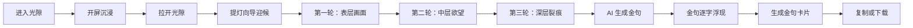
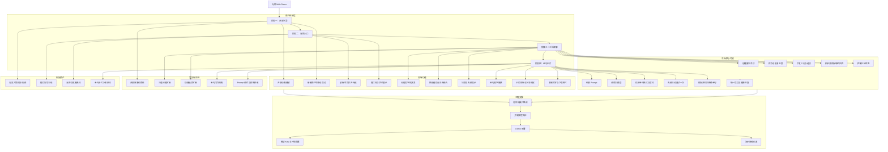
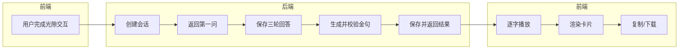

# 光隙功能全景图

> 版本：v0.1（团队同步稿）  
> 日期：2026-09-10  
> 目标：用一张全景图说明用户会经历什么、每个阶段包含哪些功能、分别由谁负责。

## 1. 产品主链路



MVP 的完成点是：**用户顺利走完三轮对话，并拿到一张属于自己的金句卡片。**

## 2. 功能全景图



## 3. 各阶段功能与负责人

| 阶段 | 用户看到的内容 | 前端负责 | 后端负责 | 策划/视觉负责 |
|---|---|---|---|---|
| 开屏沉浸 | 标签压迫、人物剪影、“轮到你了” | 播放、跳过、本地已看标记 | 无 | 故事、旁白、视频素材 |
| 光隙入口 | 用户亲手拉开一道光 | 拖拽/手势、阻尼、转场、向导出现 | 无 | 光隙质感、向导立绘与状态 |
| 三轮深聊 | 问题、选项、自由回答 | 对话框、打字机、输入、状态展示 | 会话、题目、回答、轮次、刷新恢复 | 三问与选项定稿 |
| 金句生成 | 等待后出现专属金句 | 加载态、错误态、逐字播放 | Prompt、模型调用、校验、重试、保存 | 金句规则与 Prompt 验收 |
| 金句卡片 | 白底水彩卡片 | 排版、生成图片、复制、下载 | 返回金句和 ID | 卡片视觉规范与素材 |

## 4. 后端在全景中的边界

后端从用户进入“三轮深聊”时开始介入，到返回最终金句时结束。



后端不关心光隙怎么拉开、向导怎么动、卡片长什么样；前端也不关心 Prompt 怎么写、模型怎么调用、答案如何持久化。

## 5. P0 功能清单

### 前端 P0

- 开屏播放、跳过和已看标记。
- 光隙拖拽/手势交互与进入对话转场。
- 提灯向导基本状态：迎候、待机、提问、倾听。
- 三轮问题展示、快捷选项、自由输入和提交。
- 加载、接口失败、重试提示。
- 金句逐字播放、卡片排版、复制和下载。

### 后端 P0

- 创建与查询匿名会话。
- 下发三问及快捷选项。
- 校验、保存每轮回答并控制轮次。
- 页面刷新后恢复当前问题或最终结果。
- 组装三轮回答并调用大模型。
- 校验金句前缀、长度和禁词。
- 输出不合格或模型超时时自动重试一次。
- 保存并返回唯一金句。
- 生成失败后保留回答，允许用户重试。
- 统一错误格式和健康检查。

### 策划/内容 P0

- 开屏故事与旁白定稿。
- 三道问题和全部快捷选项定稿。
- 明确是否启用追问；当前建议不启用。
- 金句长度、前缀、禁词和语言风格定稿。
- 提供至少 20 组测试回答及理想输出方向，用于 Prompt 验收。

### 视觉 P0

- 开屏人物素材。
- 提灯向导静态立绘或轻量动效素材。
- 光隙、光尘和氛围资产。
- 金句卡片水彩素材与视觉规范。

### 工程协作 P0

- 固定前后端 API 字段和错误码。
- 使用假金句先跑通全流程，再接真实模型。
- 完成刷新、重复提交、模型超时和失败重试测试。
- 准备可公开访问的 Demo 和备用演示录屏。

## 6. P1 功能

以下内容不阻塞本次 Demo：

- 金句服务端分享链接。
- 用户登录和云端图鉴。
- AI 根据回答动态追问。
- SSE 真实流式输出。
- Prompt 配置后台。
- 点赞、广场、周榜和角色频道。
- 用户反馈和使用数据统计。
- 多模型自动切换。

## 7. 明确不做

- 人格测试分数和完整测评报告。
- MBTI、九型人格、星座或其他类型判断。
- 社交推荐系统。
- 原生 App 或小程序版本。
- 复杂后台管理系统。
- Redis、消息队列、微服务和分布式部署。

## 8. 前后端联调契约

| 场景 | 前端提供 | 后端返回 |
|---|---|---|
| 开始对话 | 无或设备标识 | `sessionId`、第一问、选项 |
| 提交回答 | `sessionId`、轮次、选项或文本 | 下一问或最终金句 |
| 恢复进度 | `sessionId` | 当前状态、当前问题、已有结果 |
| 生成失败 | 重试动作 | 可重试错误或最终金句 |
| 完成体验 | 无 | `quoteId`、金句正文 |

前端只根据后端的业务状态展示页面：

```text
QUESTION_1 -> QUESTION_2 -> QUESTION_3 -> GENERATING -> COMPLETED
                                                |
                                                -> FAILED -> 重试
```

## 9. Demo 完整验收路径

1. 新用户看到开屏并进入光隙入口。
2. 用户拉开光隙，提灯向导出现。
3. 前端创建后端会话并展示第一问。
4. 用户完成三次回答，每次正确进入下一轮。
5. 后端调用模型并返回合规金句。
6. 前端逐字播放金句并生成卡片。
7. 用户能够复制文字或下载卡片图片。
8. 任意阶段接口失败时有明确提示；生成失败后无需重答三问。

这 8 步全部通过，就代表《光隙》Demo 的功能闭环完成。

