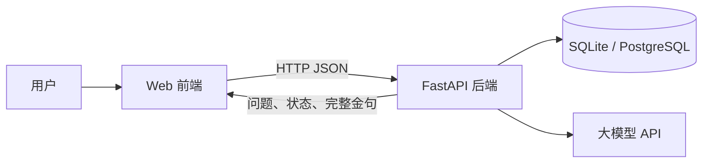
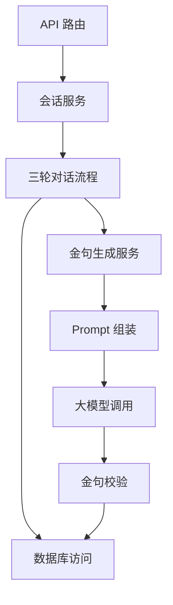
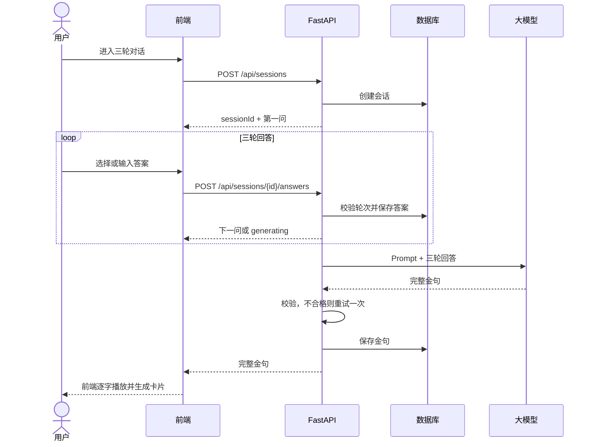
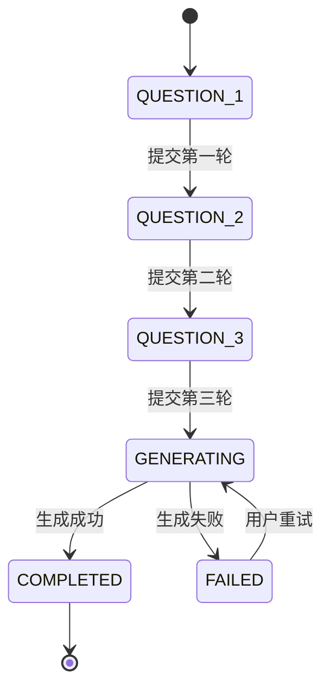
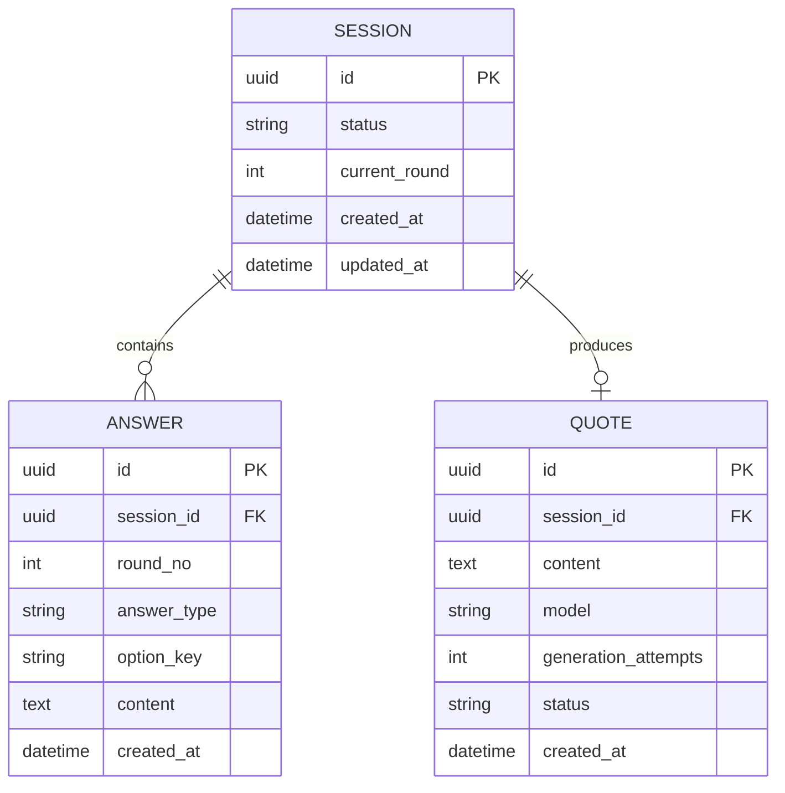
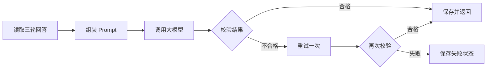

# 光隙后端架构与功能清单

> 版本：v0.2（Demo 精简版）  
> 日期：2026-09-10  
> 范围：只讨论三轮对话与金句生成后端；动画、角色、页面动效和卡片视觉不归后端。

实施任务已拆分至：[后端 Task Specs](./specs/README.md)。

## 1. 结论

这是一个小型 Demo，不需要 Redis、消息队列、微服务、Worker 集群或 Kubernetes。

后端只需：

```text
一个 FastAPI 应用 + 一个数据库 + 一个大模型 API
```

推荐组合：

- FastAPI：提供接口和组织业务逻辑。
- SQLite：本地开发和单机演示直接使用。
- PostgreSQL：只有部署到公网、需要多人同时体验时再替换。
- SQLAlchemy：让 SQLite 和 PostgreSQL 可以平滑切换。
- 大模型 API：生成最终人格金句。

数据库、问题流程和模型调用都在同一个后端进程中完成。

## 2. 后端要完成的功能

### P0：Demo 必须完成

| 编号 | 功能 | 说明 |
|---|---|---|
| 1 | 创建会话 | 用户进入对话时创建一个匿名会话，返回第一问 |
| 2 | 获取会话 | 页面刷新后可以恢复当前轮次和已有结果 |
| 3 | 提交回答 | 支持快捷选项或自由文本 |
| 4 | 三轮推进 | 后端保证按第一问、第二问、第三问依次进行 |
| 5 | 防止重复提交 | 同一轮只能保存一个有效回答，避免双击产生两条记录 |
| 6 | 生成金句 | 第三轮完成后，组合三轮回答调用大模型 |
| 7 | 校验金句 | 检查“其实，你”开头、50 字内、无 MBTI 等标签词 |
| 8 | 自动重试 | 模型超时或输出不合格时自动重试一次 |
| 9 | 保存结果 | 保存三轮回答、最终金句和生成状态 |
| 10 | 失败恢复 | 生成失败时保留前三轮回答，允许用户点击重试 |
| 11 | 基础错误处理 | 返回统一的参数错误、状态错误和模型错误 |
| 12 | 健康检查 | 提供一个接口确认后端是否正常运行 |

### P1：Demo 完成后再考虑

- 金句分享链接。
- 云端图鉴。
- 用户登录。
- Prompt 管理后台。
- 使用数据统计。
- SSE 流式输出。
- 主模型/备用模型自动切换。

前端的打字机效果不要求后端流式输出。后端可以先返回完整金句，由前端逐字播放，效果相同，实现更简单。

## 3. 不需要做的东西

- Redis：当前没有多实例共享缓存和高并发限流需求。
- 消息队列：生成金句是一次短请求，不需要异步任务系统。
- 微服务：会话、回答和生成逻辑很少，拆开只会增加联调成本。
- 独立配置中心：三问和 Prompt 先放在代码或 JSON 文件里。
- 完整账号系统：Demo 使用随机 UUID 会话即可。
- 独立监控平台：先使用结构化日志记录请求和模型错误。
- 对象存储：卡片图片由前端生成和下载，后端只保存文字。

## 4. 整体架构图



只有四个运行部分：浏览器、前端、后端、数据库；大模型是外部服务。

## 5. 后端内部结构



各模块职责：

| 模块 | 职责 |
|---|---|
| API 路由 | 接收参数、调用服务、返回 HTTP 响应 |
| 会话服务 | 创建会话、查询会话、判断是否过期 |
| 三轮对话流程 | 校验当前轮次、保存答案、决定下一步 |
| 金句生成服务 | 读取三轮回答并完成模型生成流程 |
| Prompt 组装 | 把固定规则和用户回答拼成模型输入 |
| 大模型调用 | 隔离具体供应商 SDK，方便以后更换模型 |
| 金句校验 | 检查格式、长度、禁词和空内容 |
| 数据库访问 | 统一读写 Session、Answer 和 Quote |

路由层不要直接操作数据库或调用模型，业务逻辑放在服务层即可。除此之外不需要再增加复杂分层。

## 6. 核心流程



## 7. 会话状态



首版默认不做 AI 动态追问。三问全部固定下来，先确保链路稳定。后续确实需要时，再在每一轮增加一个可选追问状态。

## 8. 数据表

只需要三张业务表。



必要约束：

- `ANSWER(session_id, round_no)` 唯一，防止同一轮重复保存。
- `QUOTE(session_id)` 唯一，防止同一会话生成多张结果。
- `SESSION.current_round` 和 `SESSION.status` 用于刷新恢复。

问题内容不需要建表，首版放在 `config/questions.json` 中。Prompt 放在 `config/prompt.txt` 中，通过 Git 保留修改历史。

## 9. API 清单

统一前缀：`/api`

| 方法 | 路径 | 用途 |
|---|---|---|
| `POST` | `/sessions` | 创建会话并返回第一问 |
| `GET` | `/sessions/{session_id}` | 获取当前轮次、当前问题或最终金句 |
| `POST` | `/sessions/{session_id}/answers` | 提交当前轮答案；第三轮后生成金句 |
| `POST` | `/sessions/{session_id}/retry` | 生成失败后重新生成金句 |
| `GET` | `/health` | 健康检查 |

### 创建会话

```http
POST /api/sessions
```

```json
{
  "sessionId": "01993f7b-...",
  "status": "QUESTION_1",
  "currentRound": 1,
  "question": {
    "key": "surface_scene",
    "text": "最近有没有一个瞬间，让你突然觉得自己不像平时的自己？",
    "options": [
      {"key": "alone", "label": "一个人时"},
      {"key": "conflict", "label": "和别人冲突时"}
    ],
    "allowFreeText": true
  }
}
```

### 提交回答

```http
POST /api/sessions/{session_id}/answers
```

```json
{
  "round": 1,
  "answer": {
    "type": "text",
    "content": "明明很累，却还是习惯先照顾别人的情绪。"
  }
}
```

第一、二轮返回下一问；第三轮直接返回完整金句：

```json
{
  "sessionId": "01993f7b-...",
  "status": "COMPLETED",
  "quote": {
    "id": "01993f80-...",
    "content": "其实，你不是习惯沉默，只是总把自己的风雨藏在别人屋檐之外。"
  }
}
```

### 统一错误格式

```json
{
  "error": {
    "code": "INVALID_SESSION_STATE",
    "message": "当前会话不能提交这一轮回答",
    "retryable": false
  }
}
```

核心错误码：

- `SESSION_NOT_FOUND`
- `ROUND_MISMATCH`
- `ANSWER_ALREADY_EXISTS`
- `ANSWER_TOO_LONG`
- `MODEL_TIMEOUT`
- `QUOTE_VALIDATION_FAILED`
- `GENERATION_FAILED`

## 10. 金句生成逻辑



校验规则：

1. 内容不能为空。
2. 以“其实，你”开头。
3. 不超过 50 字；团队需要统一标点是否计数。
4. 不包含 MBTI、九型人格、星座等标签。
5. 不出现“你属于某类人”等重新分类用户的表达。

首版不需要备用模型。调用失败或两次输出都不合格时，返回 `GENERATION_FAILED`，保留三轮回答，让用户重试即可。

## 11. 最小稳定性措施

小 Demo 仍然需要几项低成本保护：

- 单次模型调用设置 15 秒超时。
- 输出不合格最多自动重试一次，避免无限消耗额度。
- 提交答案时使用数据库事务。
- 使用数据库唯一约束防止重复答案和重复金句。
- 限制自由回答长度，例如 500 字。
- 日志记录 `session_id`、接口、耗时、模型错误，不记录密钥。
- API Key 只放环境变量，不提交到 Git。

无需为这些措施引入 Redis；Python 进程内可以做一个简单的 IP 频率限制，或者 Demo 阶段先由前端限制重复点击。若应用公开后确实遭到刷接口，再升级限流方案。

## 12. 推荐目录

```text
backend/
├── app/
│   ├── main.py
│   ├── api.py
│   ├── models.py
│   ├── schemas.py
│   ├── database.py
│   ├── services/
│   │   ├── session_service.py
│   │   └── quote_service.py
│   └── llm/
│       ├── client.py
│       ├── prompt.py
│       └── validator.py
├── config/
│   ├── questions.json
│   └── prompt.txt
├── tests/
│   ├── test_sessions.py
│   └── test_quote_validator.py
├── .env.example
├── pyproject.toml
└── README.md
```

不用再拆 `domain/application/infrastructure/repository` 四层。这个规模下，清晰的路由、服务、模型调用和数据库文件已经足够。

## 13. 开发顺序

### 第一步：假模型跑通流程

- 创建三张表。
- 完成创建会话、提交回答和获取会话接口。
- 使用固定假金句跑通三轮流程与前端联调。

### 第二步：接入真实模型

- 编写 Prompt。
- 接入模型 API。
- 实现金句校验、一次自动重试和失败状态。

### 第三步：补齐演示稳定性

- 测试刷新恢复、重复提交和模型超时。
- 补充错误提示和日志。
- 部署后根据实际情况选择继续使用 SQLite 或切换 PostgreSQL。

## 14. 完成标准

满足以下条件即可认为 Demo 后端完成：

- 用户能连续完成三轮回答并得到一条合规金句。
- 刷新页面后可以恢复当前进度或最终结果。
- 连续点击不会重复保存答案或生成多条金句。
- 模型失败不会丢失前三轮回答，用户可以重试。
- 前端只通过上述 5 个 API 完成联调。
- 模型密钥不出现在前端和代码仓库中。

## 15. 仍需团队拍板的 4 件事

1. 使用哪个大模型，以及 API 的调用方式。
2. 三道问题和快捷选项的最终文案。
3. 50 字是否包含标点和英文字符。
4. Demo 部署为单机 SQLite，还是公网 PostgreSQL。
